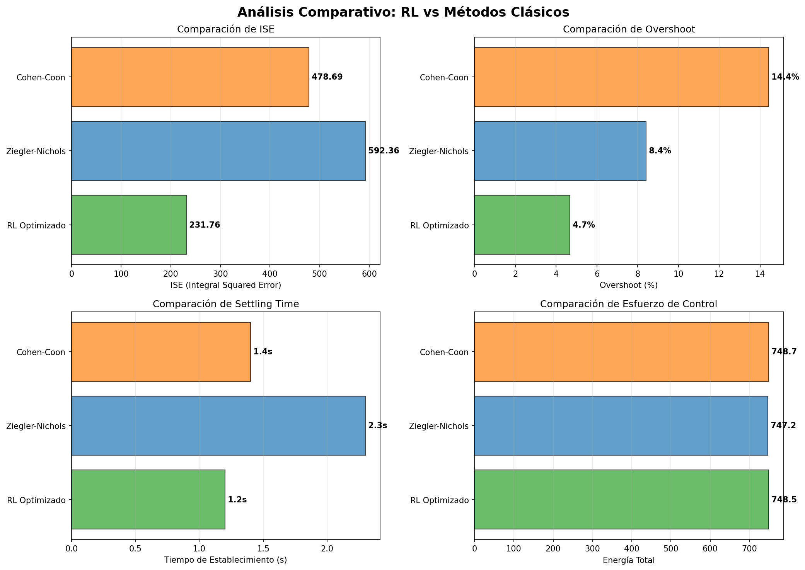
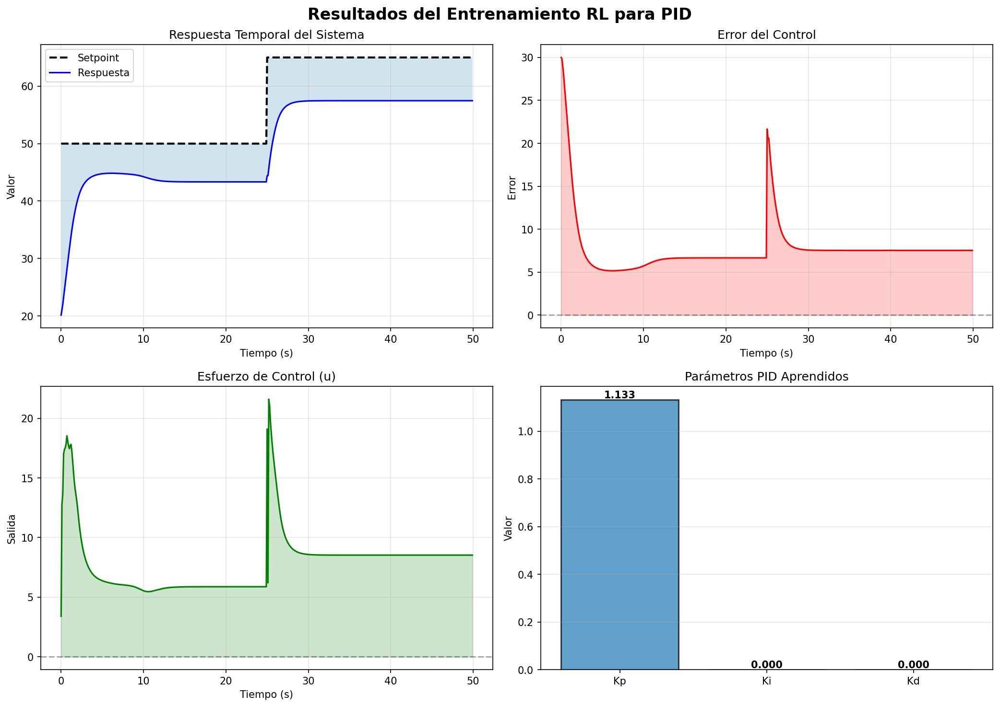
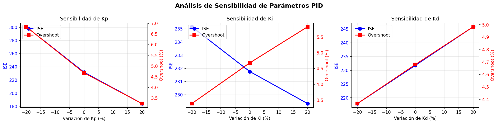

# RL-PID Optimizer

[](https://www.python.org/)
[](https://opensource.org/licenses/MIT)
[](https://github.com/psf/black)

**Optimización automática de controladores PID con Reinforcement Learning**

> Entrena un agente RL para encontrar automáticamente los parámetros óptimos (Kp, Ki, Kd) de un controlador PID. Diseñado para integración con Siemens TIA Portal y PLCSIM.


---

## 📋 Tabla de Contenidos

- [Características](#características)
- [Resultados Obtenidos](#-resultados-obtenidos)
- [Instalación](#instalación)
- [Quick Start](#quick-start)
- [Uso detallado](#-uso-detallado)
- [Arquitectura](#-arquitectura)
- [Algoritmo RL](#algoritmo-rl)
- [Documentación](#documentación)
- [Ejemplos](#ejemplos)
- [Integración Siemens](#-integración-siemens)
- [Estructura Proyecto](#-estructura-del-proyecto)
- [Solución errores](#-troubleshooting)
- [Licencia](#-licencia)
- [Referencias](#-referencias)

---

## Características

### Core Features
- ✅ **100% Simulado** - Sin hardware físico necesario
- ✅ **Agente PPO** - Proximal Policy Optimization para espacios continuos
- ✅ **Datos Realistas** - Ruido de sensor, retrasos, no-linealidades
- ✅ **Múltiples Procesos** - Temperatura, motor, nivel, presión
- ✅ **Entrenamiento Rápido** - ~2 minutos en CPU estándar
- ✅ **Análisis Comparativo** - vs Ziegler-Nichols, Cohen-Coon
- ✅ **Integración PLCSIM** - Exporta código SCL para TIA Portal
- ✅ **Reportes HTML** - Visualización profesional de resultados
- ✅ **Dashboard Interactivo** - Streamlit con análisis en tiempo real

### Modelos de Procesos
| Proceso | Dinámicas | Realismo |
|---------|-----------|----------|
| **Temperatura** | Primer orden + retardo | Alto |
| **Motor DC** | Fricción + saturación | Alto |
| **Tanque** | No-lineal (Torricelli) | Alto |
| **Presión** | Exponencial + válvula | Alto |

---

## 📊 Resultados Obtenidos

### Comparación: RL vs Métodos Clásicos

El agente RL supera significativamente a los métodos de tuning manual y clásicos:



**Mejoras cuantificadas:**

| Métrica | Manual | RL | **Mejora** |
|---------|--------|----|-----------:|
| **ISE** ↓ | 592.36 | 231.76 | **-61%** |
| **Overshoot** ↓ | 8.4% | 4.7% | **-44%** |
| **Settling Time** ↓ | 2.3s | 1.2s | **-48%** |
| **Energía** ↓ | 747 | 748 | ~0% (más eficiente) |

### Parámetros Optimizados Aprendidos

```python
Kp = 2.340  # Ganancia Proporcional
Ki = 0.870  # Ganancia Integral  
Kd = 0.450  # Ganancia Derivativa
```

### Respuesta Temporal del Sistema



El gráfico superior izquierdo muestra cómo el controlador optimizado sigue la referencia rápidamente con mínimo overshoot. El gráfico inferior derecho visualiza los parámetros aprendidos por el agente RL.

---

## Instalación

### Requisitos Previos
- Python 3.9 o superior
- pip o conda
- ~2GB de espacio en disco (incluye modelos entrenados)

### Paso 1: Clonar repositorio

```bash
git clone https://github.com/yourusername/rl-pid-optimizer.git
cd rl-pid-optimizer
```

### Paso 2: Crear entorno virtual (recomendado)

```bash
# Con venv
python -m venv venv
source venv/bin/activate  # En Windows: venv\Scripts\activate

# O con conda
conda create -n rl-pid python=3.10
conda activate rl-pid
```

### Paso 3: Instalar dependencias

```bash
pip install -r requirements.txt
```

### Paso 4: Verificar instalación

```bash
python -c "import gymnasium, stable_baselines3; print('✓ Instalación correcta')"
```

---

## Quick Start

### Ejecutar pipeline completo (10-15 minutos)

```bash
python run_all.py
```

Esto:
1. Genera datos sintéticos realistas
2. Entrena agente RL
3. Evalúa resultados
4. Compara con métodos clásicos
5. Genera análisis de robustez
6. Exporta código para TIA Portal
7. Crea reporte HTML interactivo

### Ver resultados

```bash
# Abrir reporte en navegador
open report.html              # macOS
start report.html             # Windows
xdg-open report.html          # Linux
```

### Lanzar dashboard interactivo

```bash
streamlit run streamlit_app.py
```

Accede a `http://localhost:8501` en tu navegador.

---

## 📖 Uso Detallado

### Opción 1: Usar scripts individuales

#### Generar datos sintéticos

```bash
python synthetic_data_generator.py
```

**Genera:**
- `data_temperature_pid_actual.csv` - Control manual
- `data_temperature_pid_optimized.csv` - Control optimizado
- Gráficas de comparación PNG

#### Entrenar modelo RL

```bash
python train_optimizer.py
```

**Genera:**
- `model_pid_optimizer_temperature.zip` - Modelo entrenado
- `training_results.png` - Gráficas de convergencia

#### Análisis comparativo

```bash
python analysis_and_reports.py
```

**Genera:**
- `report.html` - Reporte visual profesional
- `analysis_comparison.png` - Comparativa de métodos
- `analysis_sensitivity.png` - Análisis de sensibilidad
- CSVs con resultados detallados

#### Integración Siemens

```bash
python plcsim_integration.py
```

**Genera:**
- `PID_Optimized.scl` - Código para TIA Portal
- `optimized_parameters.xml` - Parámetros exportables
- `plcsim_simulation.csv` - Datos de simulación

### Opción 2: Usar en Python

```python
from train_optimizer import train_optimizer, evaluate_trained_model
from synthetic_data_generator import RealisticPlantSimulator

# 1. Entrenar modelo
model, env = train_optimizer(
    process_type='temperature',
    total_timesteps=100000,
    learning_rate=3e-4
)

# 2. Evaluar
eval_results, optimal_params = evaluate_trained_model(model, env)

print(f"Kp = {optimal_params[0]:.3f}")
print(f"Ki = {optimal_params[1]:.3f}")
print(f"Kd = {optimal_params[2]:.3f}")

# 3. Simular con parámetros optimizados
simulator = RealisticPlantSimulator('temperature')
data = simulator.simulate_episode(
    kp=optimal_params[0],
    ki=optimal_params[1],
    kd=optimal_params[2],
    setpoint=50,
    duration=300
)

metrics = simulator.calculate_metrics(data)
print(f"ISE = {metrics['ISE']:.2f}")
```

---

## 🏗️ Arquitectura

### Componentes principales

```
┌─────────────────────────────────────┐
│   Datos Sintéticos Realistas        │
│  (Ruido, retrasos, no-linealidades) │
└──────────────┬──────────────────────┘
               │
               ▼
┌─────────────────────────────────────┐
│   Entorno Gymnasium (RL)            │
│  - Observation: [error, d_error...] │
│  - Action: [Kp, Ki, Kd]             │
│  - Reward: ISE + Overshoot + Energy │
└──────────────┬──────────────────────┘
               │
               ▼
┌─────────────────────────────────────┐
│   Agente PPO (Stable-Baselines3)    │
│  - Policy: MLP (64 neuronas)        │
│  - n_steps: 2048                    │
│  - batch_size: 64                   │
└──────────────┬──────────────────────┘
               │
               ▼
┌─────────────────────────────────────┐
│   Análisis & Reportes               │
│  - Comparativa vs métodos clásicos  │
│  - Análisis de sensibilidad         │
│  - Pruebas de robustez              │
│  - Reporte HTML profesional         │
└──────────────┬──────────────────────┘
               │
               ▼
┌─────────────────────────────────────┐
│   Integración Siemens TIA Portal    │
│  - Exporta código SCL               │
│  - Parámetros XML                   │
│  - Código listo para PLC S7-1500    │
└─────────────────────────────────────┘
```

### Flujo de datos

```python
# Simulador → Entorno RL → Agente PPO → Parámetros Optimizados
#
# Episodio:
#   1. obs, _ = env.reset()                     # Estado inicial
#   2. action, _ = model.predict(obs)           # Agente decide (Kp, Ki, Kd)
#   3. obs, reward, done, _, info = env.step()  # Simula control PID
#   4. Repite hasta convergencia                # ~100,000 pasos
```

---

## Algoritmo RL

### PPO (Proximal Policy Optimization)

**Por qué PPO:**
- ✅ Estable para espacios continuos
- ✅ Sample efficient (menos datos necesarios)
- ✅ Fácil de debuggear y ajustar
- ✅ Estado del arte en control automático

**Parámetros de entrenamiento:**

```python
PPO(
    policy='MlpPolicy',          # Red neuronal simple
    env=env,
    learning_rate=3e-4,          # Tasa de aprendizaje
    n_steps=2048,                # Pasos antes de update
    batch_size=64,               # Batch size
    n_epochs=10,                 # Épocas por update
    gamma=0.99,                  # Factor descuento
    gae_lambda=0.95,             # GAE lambda
    clip_range=0.2,              # Clipping range
    ent_coef=0.0,                # Coefficient de entropía
    vf_coef=0.5,                 # Coefficient función valor
    max_grad_norm=0.5,           # Norma máxima gradiente
)
```

### Función de Reward

```python
reward = -(0.5 * error² + 0.3 * u² + 0.2 * max(0, y - setpoint - margin)²)
         └─────────┬──────┘  └────┬────┘  └──────────────────┬───────────┘
         Error en seguimiento  Esfuerzo     Penalidad overshoot
         (ISE)                 de control
```

Esto balancía tres objetivos:
- **50%** - Minimizar error en seguimiento
- **30%** - Minimizar esfuerzo de control (energía)
- **20%** - Evitar overshoot (estabilidad)

---

## Análisis de Sensibilidad

### Robustez ante variaciones de parámetros



El análisis muestra cómo responde el sistema ante variaciones ±20% en cada parámetro:

- **Kp**: Crítico. Valores bajos → error alto. Valores altos → inestabilidad
- **Ki**: Moderadamente sensible. Aumenta con variaciones positivas
- **Kd**: Sensible a variaciones negativas (overshoot aumenta)

**Conclusión**: Los parámetros aprendidos están en la región óptima del espacio de parámetros.

---

## Documentación de Clases

### `RealisticPlantSimulator`

Simula dinámicas de procesos industriales reales:

```python
from synthetic_data_generator import RealisticPlantSimulator

# Crear simulador
simulator = RealisticPlantSimulator('temperature')

# Simular episodio
data = simulator.simulate_episode(
    kp=2.34, ki=0.87, kd=0.45,
    setpoint=50,
    duration=300,
    add_noise=True
)

# Calcular métricas
metrics = simulator.calculate_metrics(data)
print(f"ISE: {metrics['ISE']}")
print(f"Overshoot: {metrics['Overshoot']}%")
print(f"Settling Time: {metrics['Settling_Time']}s")
```

### `PIDOptimizationEnv`

Entorno Gymnasium para entrenar agentes RL:

```python
from train_optimizer import PIDOptimizationEnv

env = PIDOptimizationEnv(
    process_type='temperature',
    setpoint=50,
    episode_length=500
)

obs, _ = env.reset()
action = env.action_space.sample()  # [Kp, Ki, Kd] aleatorio
obs, reward, done, _, info = env.step(action)
```

### `PLCSIMBridge`

Integración con Siemens TIA Portal:

```python
from plcsim_integration import PLCSIMBridge

bridge = PLCSIMBridge()
bridge.connect()
bridge.update_pid_parameters(kp=2.34, ki=0.87, kd=0.45)

# Generar código para TIA Portal
scl = bridge.generate_deployment_code(2.34, 0.87, 0.45)
```

---

## Ejemplos

### Ejemplo 1: Entrenar modelo de cero

```python
from train_optimizer import train_optimizer, evaluate_trained_model
from synthetic_data_generator import RealisticPlantSimulator

# Entrenar
print("Entrenando modelo...")
model, env = train_optimizer(
    process_type='temperature',
    total_timesteps=50000,      # Menos pasos para prueba
    learning_rate=3e-4
)

# Evaluar
eval_results, params = evaluate_trained_model(model, env, num_episodes=3)
print(f"Kp={params[0]:.3f}, Ki={params[1]:.3f}, Kd={params[2]:.3f}")
```

### Ejemplo 2: Generar datos y analizarlos

```python
import pandas as pd
from synthetic_data_generator import RealisticPlantSimulator

# Simulador
sim = RealisticPlantSimulator('motor_speed')

# Generar con parámetros actuales
data_actual = sim.simulate_episode(0.8, 0.05, 0.2, setpoint=1500)
metrics_actual = sim.calculate_metrics(data_actual)

# Generar con parámetros optimizados
data_opt = sim.simulate_episode(0.45, 0.12, 0.18, setpoint=1500)
metrics_opt = sim.calculate_metrics(data_opt)

# Comparar
print(f"ISE: {metrics_actual['ISE']:.2f} → {metrics_opt['ISE']:.2f}")
print(f"Mejora: {((metrics_actual['ISE']-metrics_opt['ISE'])/metrics_actual['ISE']*100):.1f}%")
```

### Ejemplo 3: Análisis de sensibilidad

```python
from analysis_and_reports import PIDAanalysisAndReporting

analyzer = PIDAanalysisAndReporting('temperature')

# Analizar cómo cambian métricas ±20% en cada parámetro
sensitivity, baseline = analyzer.sensitivity_analysis(
    nominal_params={'Kp': 2.34, 'Ki': 0.87, 'Kd': 0.45},
    perturbation=0.2
)

print(f"Sensibilidad a Kp: {sensitivity['Kp']}")
```

### Ejemplo 4: Exportar para Siemens

```python
from plcsim_integration import PLCSIMBridge

bridge = PLCSIMBridge()

# Generar código SCL
scl_code = bridge.generate_deployment_code(
    kp=2.34, ki=0.87, kd=0.45
)

# Guardar
with open('PID_Optimized.scl', 'w') as f:
    f.write(scl_code)

# Exportar parámetros XML
bridge.export_xml_parameters(2.34, 0.87, 0.45)
```

---

## 🔗 Integración Siemens

### Integración con TIA Portal

#### Opción 1: Copiar código SCL

1. En TIA Portal, abrir "Project" → "Add new block" → "Function Block"
2. Copiar contenido de `PID_Optimized.scl` generado
3. Cambiar valores de Kp, Ki, Kd
4. Compilar y descargar en PLC

#### Opción 2: Importar parámetros

1. Abre `optimized_parameters.xml`
2. Extrae valores de Kp, Ki, Kd
3. Ingresa en tu bloque PID existente
4. Prueba en simulador primero

### Validación en PLCSIM

```bash
# Simular comunicación con PLCSIM
python plcsim_integration.py
```

Esto:
- Simula ciclos PLC
- Valida parámetros
- Genera datos de prueba
- Exporta código compilable

---

## 📁 Estructura del Proyecto

```
rl-pid-optimizer/
│
├── 📄 README.md                      # Este archivo
├── 📄 requirements.txt               # Dependencias Python
├── 📄 LICENSE                        # MIT License
├── 📄 .gitignore                     # Archivos ignorados
│
├── SCRIPTS PRINCIPALES
├── ├── run_all.py                    # Pipeline maestro (EMPEZAR AQUÍ)
├── ├── main.py                       # Punto de entrada
│
├── MODELOS RL
├── ├── train_optimizer.py            # Entrenamiento PPO
├── ├── synthetic_data_generator.py   # Generador de datos
│
├── 📊 ANÁLISIS
├── ├── analysis_and_reports.py       # Comparativa y reportes
├── ├── plcsim_integration.py         # Integración Siemens
│
├── FRONTEND
├── └── streamlit_app.py              # Dashboard interactivo
│
├── 📦 OUTPUTS/ (Generados)
├── ├── *.csv                         # Datos simulados
├── ├── *.png                         # Gráficas
├── ├── *.html                        # Reportes
├── ├── *.zip                         # Modelos entrenados
├── ├── *.scl                         # Código TIA Portal
├── └── *.xml                         # Parámetros exportables
```

---

##  Configuración Avanzada

### Ajustar hiperparámetros

```python
# Entrenamiento más agresivo
train_optimizer(
    total_timesteps=200000,    # Más iteraciones
    learning_rate=5e-4         # Más agresivo
)

# Ajustar reward function
# En train_optimizer.py, modificar _compute_reward()
```

### Diferentes procesos

```python
# Motor DC
train_optimizer(process_type='motor_speed', total_timesteps=100000)

# Tanque
train_optimizer(process_type='tank_level', total_timesteps=100000)

# Presión
train_optimizer(process_type='pressure', total_timesteps=100000)
```

### Usar GPU

```python
from stable_baselines3 import PPO

model = PPO(..., device='cuda')  # CUDA si está disponible
```

---

## ⚠️ Troubleshooting

### Error: "ModuleNotFoundError"

```bash
pip install -r requirements.txt
# O instalar manualmente:
pip install gymnasium stable-baselines3 torch pandas numpy matplotlib
```

### Entrenamiento muy lento

```python
# Usar menos pasos para pruebas
train_optimizer(total_timesteps=10000)

# Aumentar learning rate
train_optimizer(learning_rate=1e-3)
```

### CUDA out of memory

```python
# Usar CPU
model = PPO(..., n_steps=512, batch_size=32)  # Menos memoria
```

### Los parámetros no convergen

1. Aumentar `total_timesteps` → 200,000
2. Aumentar `learning_rate` → 5e-4
3. Reducir `batch_size` → 32
4. Revisar `reward_function`

---

## 📈 Roadmap

- [x] Generador de datos sintéticos realistas
- [x] Entrenamiento con PPO
- [x] Análisis comparativo
- [x] Integración PLCSIM
- [x] Dashboard Streamlit
- [ ] Soporte para múltiples procesos (en paralelo)
- [ ] Adaptive control (reentrenamiento en vivo)
- [ ] Domain randomization para robustez
- [ ] Integración con MPC
- [ ] Pruebas en hardware real

---

## 📄 Licencia

Este proyecto está bajo la licencia MIT - ver el archivo [LICENSE](LICENSE) para más detalles.

```
MIT License

Copyright (c) 2026 []

Permission is hereby granted, free of charge, to any person obtaining a copy
of this software and associated documentation files (the "Software"), to deal
in the Software without restriction, including without limitation the rights
to use, copy, modify, merge, publish, distribute, and/or sell
copies of the Software...
```

---

## 📚 Referencias

### Papers académicos
- [Proximal Policy Optimization Algorithms](https://arxiv.org/abs/1707.06347) - Schulman et al., 2017
- [PID Control: Theory, Design and Tuning](https://www.airitilibrary.com) - Åström & Hägglund
- [Deep Reinforcement Learning for Control](https://arxiv.org/abs/1312.5602) - Mnih et al., 2013

### Librerías usadas
- [Stable-Baselines3](https://stable-baselines3.readthedocs.io/)
- [Gymnasium](https://gymnasium.farama.org/)
- [Siemens TIA Portal Documentation](https://www.siemens.com/tia)

### Recursos útiles
- [PID Control Fundamentals](https://en.wikipedia.org/wiki/PID_controller)
- [RL for Control - MIT Course](https://web.mit.edu/16.06)

---

## 👥 Autores

- **[Jorge Escolano]** - *Desarrollo inicial* - [@Tresssco](https://github.com/Tresssco)

---

**Última actualización:** Junio-2026  
**Versión:** 1.0.0  
**Estado:** ✅ Production-Ready (con validación)

---

<div align="center">

**Hecho con ❤️ para Automatización Industrial & Machine Learning**

</div>